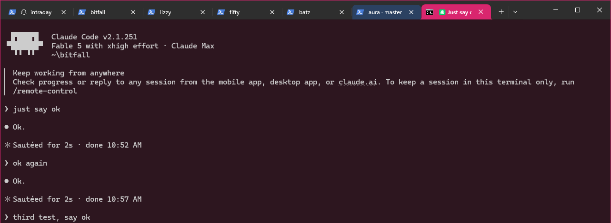

# aura

Color identity for Claude Code terminal sessions. Repo = hue, branch = shade.
With 10+ agent windows open, you find the right one by color, not by reading.



One Windows Terminal window, three Claude Code sessions: the active bitfall
session got a pink tab, a pink-tinted pane, and a pink window border; the aura
session's tab is blue. Nothing was configured by hand.

## What it does

On every Claude Code session start and prompt, a hook:

1. **Colors the tab** (Windows Terminal, iTerm2) with the repo's color. In
   tabbed windows this is the primary identity surface.
2. **Tints the pane background** with a dark shade of the same color (OSC 11).
3. **Paints the real window frame** (border + title bar) via the Windows 11
   DWM API. In stock tabbed Windows Terminal only a 1 px border shows (WT
   draws its own tab strip over the title bar); on floating windows and
   conhost-style terminals the full caption shows.
4. **Sets the title** to `repo · branch` (best-effort; Claude Code itself
   keeps the latest prompt in the title, which covers "what am I doing here").

Colors are deterministic: the same repo maps to the same hue on every machine,
every restart. Branches get discrete shades of the repo hue; main/master is
the base shade. Outside a git repo the working folder is the identity.

## Install

Once `@kitfunso/aura` is on npm:

```
npx @kitfunso/aura
```

From a checkout today:

```
node bin/install.js
```

This merges two hook entries (SessionStart, UserPromptSubmit) into
`~/.claude/settings.json`. The previous file is backed up to
`settings.json.aura-bak` first. Re-running adds nothing (idempotent).
Colors appear in sessions started after the install.

Uninstall:

```
node bin/install.js --uninstall
```

Target a different settings file (testing, non-standard setup) with
`--settings <path>`; the backup lands next to that file.

Requirements: Windows 11 build 22000+ for the frame color, Windows Terminal
1.15+ for the tab color, Node.js. Tint + title degrade gracefully elsewhere.
No runtime dependencies, no network calls, everything local.

## How it works (and the traps we measured)

The design is shaped by four findings, all measured live on 2026-08-30
(details in `docs/ARCHITECTURE.md` Known Risks):

- **Claude Code hooks get their own hidden console on Windows.** A hook's
  `CONOUT$` write succeeds but is invisible. Visible delivery attaches to the
  topmost console-attached ancestor (the tab's real console) from the
  PowerShell adapter, once per session or color change. The per-prompt path
  spawns nothing and stays at ~70 ms.
- **Windows Terminal runs every window in one process**, so PID matching
  cannot identify a window. The frame paint takes `GetForegroundWindow()` at
  prompt time, allowlisted to terminal processes, and caches the HWND.
- **Claude Code rewrites the terminal title continuously**, so a
  nonce-title handshake is impossible and aura's title is best-effort.
- **Tab color needs the DECAC escape** (`OSC 4;200;rgb:RR/GG/BB` +
  `ESC[2;15;200,|`). The extended palette slot 262 from the WT tab-color PR
  recolors the pane background on current builds, not the tab.

Repo layout: `src/color.js` (the pure color contract), `src/hook.js` (hook
entry), `src/tty.js` (terminal device), `src/adapters/frame-win.ps1` (all
Win32 code), `bin/install.js` (installer). Tests: `node --test test/`.

## Cross-platform

The core is OS-neutral; only the tty device path and the frame adapter vary.
macOS/Linux get tint + title (and iTerm2 tab color) from the same code today;
frame adapters for them are planned (macOS needs an overlay window, there is
no API to recolor another app's frame). See the support matrix in
`docs/ARCHITECTURE.md`.

## Lane B (later)

The color contract in `src/color.js` is written to be lifted unchanged into a
cross-app overlay that colors Slack/browser/other-agent windows the same way.
That is a separate tool; this repo only guarantees the contract stays pure.
